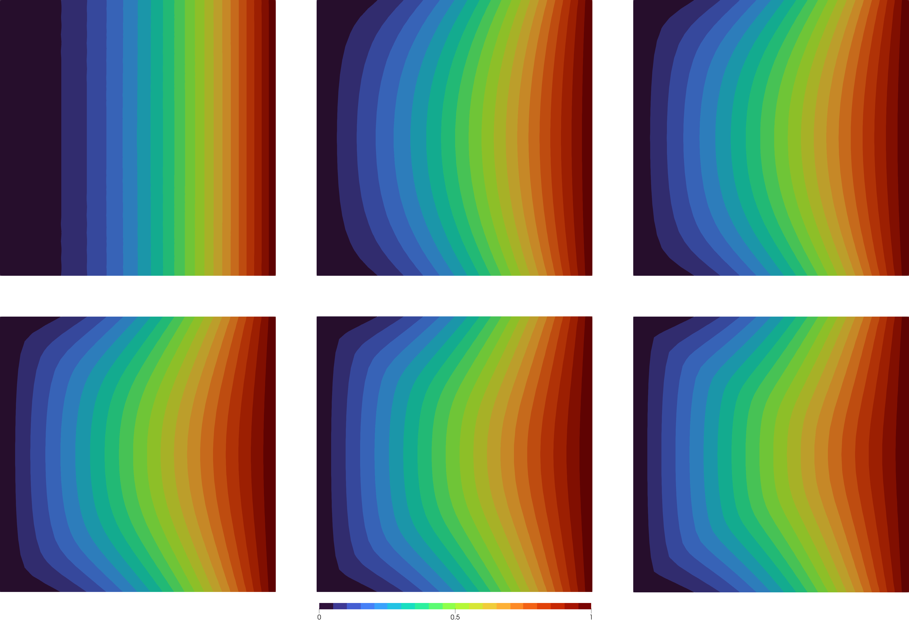

# A Dirichlet Problem

Let's go through a code for the _p_-Laplace equation on a unit square

```math
\Omega = (0,1)^2
```
with boundary
```math
\Gamma = \partial \Omega
```
and inhomogeneous Dirichlet boundary conditions given by
```math
\begin{aligned}
-\Delta_p v = 0 &\quad \text{in}\; \Omega,\\
v = x_1^2 &\quad \text{on}\; \Gamma.
\end{aligned}
```

First, we have to load the package PLaplace:
```julia
using PLaplace
```

Then it is useful to set up a results directory
where all the results for one test case are stored.
The following functions will do that:
```julia
output_path::String = "results/dirichlet-square/"
mkpath(output_path)
```

If you do multiple computations, e.g. for different values of p,
you might like to compare the runs.
Therefore, you can create a statistics file with the corresponding header.
Here, the guarded flag means that if the file already exists with a header,
the file will **not** be cleared and rewritten.
This is in particular helpful if you have already run a script
and want to keep the results. 
```julia
statistics_file = output_path * "statistics.txt"
write_statistics_header(statistics_file, guarded = true)
```

Now, we can create the mesh of our computational domain.
`PLaplace.jl` is based on the finite element library
[`MinFEM.jl`](https://minfem.github.io/MinFEM.jl/stable/).
Some basic functions are re-exported, so we can simply use
```julia
mesh = import_mesh("../meshes/square.msh")
dirichlet_boundary = select_boundaries(mesh)
```

!!! tip
    You can also additionally load the `MinFEM.jl` package to get access to all its
    features.
    For example, you could generate a custom mesh of the unit square,
    e.g., with 30x30 nodes.
    ```julia
    using PLaplace, MinFEM

    mesh = unit_square(30)
    ```
    This can be quite useful later on
    if you also want to do post-processing and custom projects.

Then, we specify the boundary condition analytically by
```julia
g(x) = x[1]^2
```
If no analytical description is available,
it is also possible to define a coefficient vector using `MinFEM.jl`'s functionalities,
but that would exceed the scope of this tutorial.

With the preparations done, we can now run the algorithm by
```julia
data = solve_plaplace(p, mesh, g, dirichlet_boundary)
```
The returned object data is of type `PLaplaceData`.
In this object, all kinds of relevant information are stored.
Please see its documentation in the [library](@ref PLaplaceData) for all properties.
Here, we want to limit ourselves to its two main use cases.

First, we can use it to write an entry to the previously created statistics file
```julia
write_statistics(statistics_file, data)
```
Second, we can write the result to a .vtk-file
```julia
write_result_to_vtk(output_path * "result_p=$p", data)
```
This file can be used, for example, to visualize the result in Paraview.
Some instructions for that can be found in the corresponding section
of the `MinFEM.jl` [documentation](https://minfem.github.io/MinFEM.jl/stable/paraview/).

!!! info "Visualization"
    Here is an example of what different solutions might look like.

    |  |
    |:--:|
    |*Solution of the problem for various p = 1, 2, 3, 5, 8, 15 (left to right).*|
