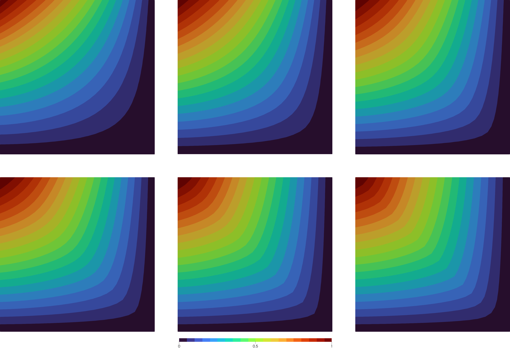

# A Neumann Problem

Let's go through a code for the _p_-Laplace equation on a unit square

```math
\Omega = (0,1)^2
```
and a part of the boundary
```math
\Gamma = (\{0\} \times [0,1]) \cup ([0,1] \times \{1\})
```
with mixed homogeneous Dirichlet and inhomogeneous Neumann boundary conditions given by
```math
\begin{aligned}
-\Delta_p v = 0 &\quad \text{in}\; \Omega,\\
\Vert \nabla v \Vert_2^{p-2} \frac{\partial v}{\partial \eta}  
    = x_2^2 - x_1^2 &\quad \text{on}\; \Gamma,\\
v = 0 &\quad \text{on}\; \partial\Omega\setminus\Gamma.
\end{aligned}
```

The code is quite similar to the [Dirichlet Problem](@ref A-Dirichlet-Problem),
so here, we will mainly focus on the few differences.

Includes and file creation are identical
```julia
using PLaplace

output_path::String = "results/neumann-square/"
mkpath(output_path)

statistics_file = output_path * "statistics.txt"
write_statistics_header(statistics_file, guarded = true)
```

For the mesh with boundary conditions,
we will now select two different sets of physical boundaries.
One for the Dirichlet part and one for the Neumann part.
```julia
mesh = import_mesh("../meshes/square.msh")

dirichlet_boundary = select_boundaries(mesh, 1001, 1004)
neumann_boundary = select_boundaries(mesh, 1002, 1003)
```
Here, in particular, the IDs 1001 and 1004 denote the bottom and
the right boundary of the square, respectively.
1002 and 1003 are the remaining top and left boundaries.
Note that the two boundary sets shall be distinct.
If a node is in the Dirichlet boundary,
it will be fixed within the algorithm, and the Neumann condition is ignored.
For any mesh, you get the physical boundary ideas from the mesh file.
The whole procedure of boundary selection is only possible if the boundaries
were specified as physical elements in gmsh during the creation of the mesh.

The boundary conditions themselves can again be specified analytically using
```julia
h(x) = x[2]^2 - x[1]^2
g(x) = 0
```

For actually using the Neumann condition in the algorithm, 
the condition itself and the boundary where it shall be applied 
have to be provided via keyword arguments.
```julia
data = solve_plaplace(
    p,
    mesh,
    g,
    dirichlet_boundary,
    h = h,
    neumann_boundary = neumann_boundary
)
```
Note that here, the identifier left of the assignment is the name of the keyword,
which is specified in the api.
To see a full list of keywords, see the documentation in the [library](@ref solve_plaplace).
The identifier on the right is the local name of the variable we created
and only the same by (intended) coincidence.

Writing output files is no different from the Dirichlet example and is performed with
```julia
write_statistics(statistics_file, data)

write_result_to_vtk(output_path * "result_p=$p", data)
```

!!! info "Visualization"
    The output files can again be used for external post-processing.\
    Selected visualized results for comparison are given here.

    |  |
    |:--:|
    | *Solution of the problem for various p = 2, 3, 5, 8, 15, 25 (left to right).* |
