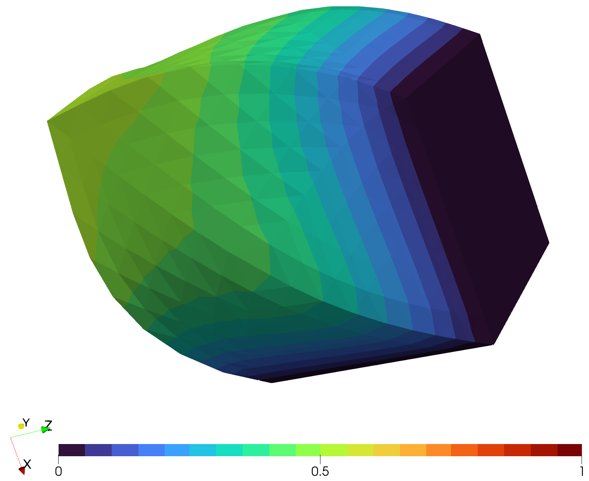

# A Vector-Valued Problem

As a vector-valued problem, we will consider a problem in 3 dimensions,
where the solution also has 3 components.
The general treatment is the same as for the 2-dimensional cases that we have seen before.
The dimensions are somewhat hidden in the mesh and the descriptions
of source terms and boundary conditions.
Thus, we need to use the additional keyword argument `qdim` to specify the
number of components matching those of the function descriptions.

The start of the program is similar to before.
Just note that in difference to the Neumann example, we now include the `cube.msh` mesh and
there are now 6 physical boundaries corresponding to the 6 faces to select from.

```julia
using PLaplace

output_path = "results/NeumannProblem3DVector/"
mkpath(output_path)

statistics_file = output_path * "statistics.txt"
write_statistics_header(statistics_file, guarded = true)

mesh = import_mesh("../meshes/cube.msh")
neumann_boundary = select_boundaries(mesh, 1003, 1004, 1005)
dirichlet_boundary = select_boundaries(mesh, 1001, 1002, 1006)
```

In general, the definition of boundary conditions works the same as before.
Just that the output is now an array instead of just a scalar.
In this example, the description of h corresponds
```math
h(x) = \Vert x \Vert_2 \, \eta
```
where ``\eta`` denotes the outer normal vector and results in a pulling force.
```julia
g(x) = [0,0,0]
function h(x)
    a = sqrt(sum(x.^2))
    if x[1] > 0
        if x[2] > 0
            return a * [0,0,-1]
        else
            return a * [0,-1,0]
        end
    else
        return a * [-1,0,0]
    end
end
```

Solving the equation and providing output files is now quite similar to
the Neumann example.
As mentioned before, the only difference is the usage of the keyword argument `qdim = 3`.
This corresponds to the number of components we previously specified for g and h.
Note that using this argument is **mandatory**.
Only specifying multiple components in the functions will lead to
index-out-of-bounds errors.
```julia
p::Float64 = 5

data  = solve_plaplace(
    p,
    mesh,
    g,
    dirichlet_boundary,
    h = h,
    neumann_boundary = neumann_boundary,
    qdim = 3
)
    
write_statistics(statistics_file, data)
write_result_to_vtk(output_path * "result_p=$p", data)
```

!!! info "Visualization"
    With the resulting files, you could proceed to visualization.
    Here, a warped and rotated version of the cube for ``p=5`` is shown.

    